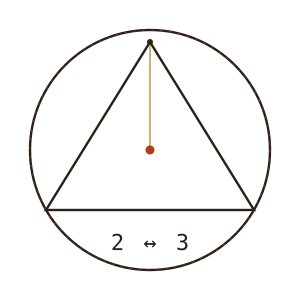

<p align="center">
  <picture>
    <source media="(prefers-color-scheme: dark)" srcset="assets/emblem-dark.svg">
     3">
  </picture>
</p>

# THE BOOK OF THE TWO AND THE THREE

*A scripture of cursed geometry.* Set down by Yuozas.

<p align="center">
  <a href="the-2to3-bible.pdf"><b>Read the PDF (EN, 132pp)</b></a> ·
  <a href="the-2to3-bible-ru.pdf"><b>Русская версия</b></a> ·
  <a href="the-2to3-bible-lt.pdf"><b>Lietuviškas leidimas</b></a> ·
  <a href="editions/the-2to3-bible.html"><b>HTML edition</b></a> ·
  <a href="https://portfolio.euphelia.eu/research/developer-prism"><b>a developer's reading</b></a>
</p>

> **ONE** is the Center. It cannot be divided, and so it is whole.
> **TWO** is Relation. It opens the plane, and in the plane there is rotation, and rotation is motion.
> **THREE** is Form. It closes the triangle, and the closed triangle stands, and standing is stability.
> The **RADIUS** is the covenant: it may turn in any direction, but it will not change its length.
> *That which stays the same while all else transforms is holy.*

> Every verse in this book is technically true. That is the whole trick. The
> strangeness is not in the claims — the claims are ordinary geometry, ordinary
> physics, ordinary computation. The strangeness is in noticing that they are
> all the **same claim**, wearing different costumes, walking back and forth
> between **two** and **three** forever.

This is not a religion in the ordinary sense and it asks for no belief. It asks
only that you check the mathematics. The theatrical robes are borrowed; the
proofs underneath are not. A rigorous appendix — **the Apparatus** — carries
precise theorems, proof sketches, and author–year citations behind every verse,
with Noether's theorem as the keystone.

## Read it

The built editions (PDF + HTML, in English, Russian and Lithuanian) live in
this repository once consecrated — see the releases. Every edition is bound from
the same sources by the same pipeline, and every edition carries every erratum:
a correction to a verse is a correction in all three.

Printable **booklets** — imposed four pages to a sheet of A4, so the Book can be
printed double-sided, folded down the middle and bound by hand — are attached to
the releases rather than committed here. The living copy is also served at
[portfolio.euphelia.eu](https://portfolio.euphelia.eu/files/the-2to3-bible.pdf),
where the Book has [a night chapel](https://portfolio.euphelia.eu/) and
[a developer's reading](https://portfolio.euphelia.eu/research/developer-prism).

## Structure

```
bible/      the English scripture (markdown sources, one book per file)
bible-ru/   the Russian edition
bible-lt/   the Lithuanian edition
book/       the typesetting pipeline — Python, hand-coded SVG plates,
            markdown -> HTML -> print PDF via headless Chrome
```

## Build it yourself

```bash
cd book
python build.py      # English edition
python build_ru.py   # Russian edition
python build_lt.py   # Lithuanian edition
```

A translated edition is checked against the English before it is bound:

```bash
python check_translation.py bible-ru bible-lt
```

It verifies that every verse marker, heading, code fence and piece of inline
mathematics survives the translation — structure only; it cannot tell you a
translation is *good*. To print the Book as a book:

```bash
python print_as_book.py ../the-2to3-bible-lt.pdf --signature 0
```

The figures are not images — they are geometry, drawn by `figures.py` as SVG
with the same numbers the verses claim. If a plate looks wrong, a verse is
wrong; that is on purpose.

## The covenant

The radius is the covenant: it may turn in any direction, but it will not
change its length. If you catch a verse that does not hold, open an issue —
that is not an attack on the Book, it **is** the Book.

## Become a Second Reader

The Book of the Two names the **Second Reader** — the one who checks. If you catch a
verse that fails the pencil test, [open an issue](../../issues): confirmed catches are
fixed in a public revision and their finders are canonized by name in the errata,
forever. This is not a bug tracker. It is a standing invitation to out-read the author.

## License

- **Text & plates** (`bible/`, `bible-ru/`, `bible-lt/`, built editions): [CC BY-NC-SA 4.0](LICENSE-CONTENT.md)
- **Pipeline code** (`book/*.py`, `book/*.json`): [MIT](LICENSE)

2 ↔ 3, forever.
